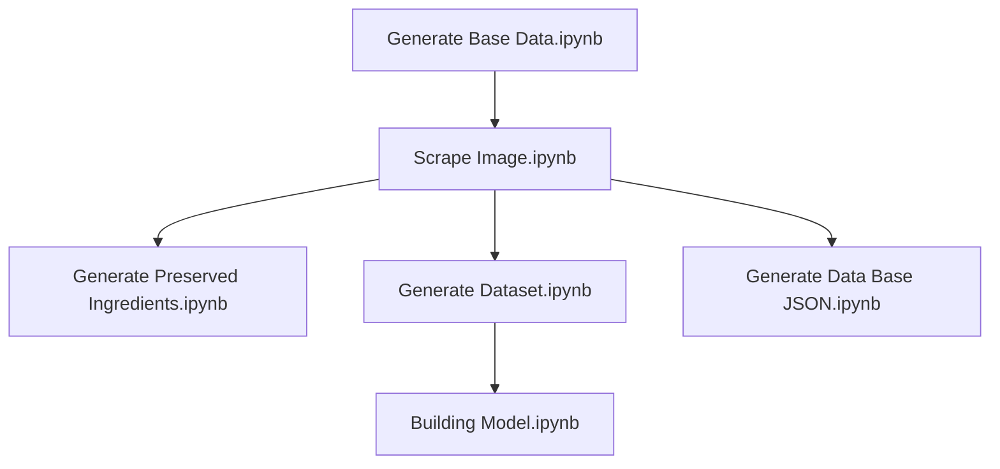

# Project Title

A brief description of your project.

## Repository Structure

The repository contains the following main components:

- `notebooks/`: Jupyter notebooks used for generating and processing data that has been stored in root.

## Notebooks Execution Order

To reproduce the data generation and model building process, execute the Jupyter notebooks in the following order:

